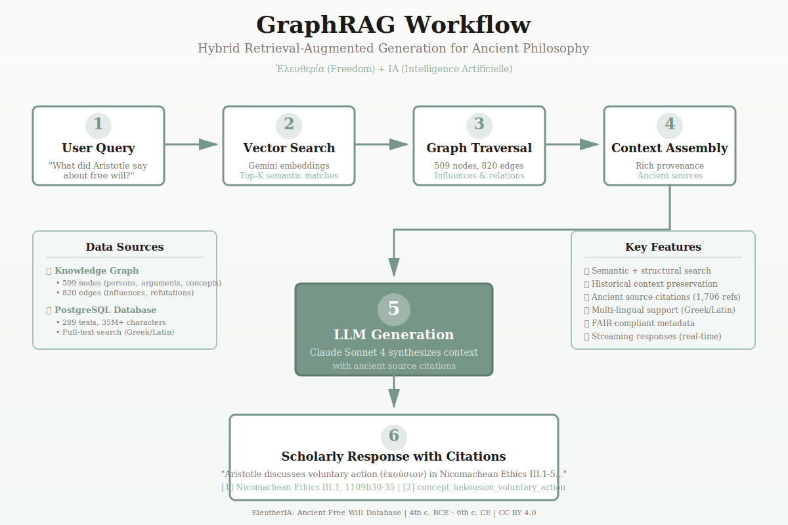

# EleutherIA Infographics - Creation Summary

Beautiful, academically-styled visual assets have been created for the EleutherIA project!

---

## ✨ What Was Created

### 1. Three Main Infographics (SVG)

#### **GraphRAG Workflow** (`graphrag-workflow.svg`)
- **Size**: 1200×800px
- **Purpose**: Step-by-step explanation of the GraphRAG process
- **Features**:
  - 6 numbered steps with clear visual flow
  - Data sources sidebar (Knowledge Graph + PostgreSQL)
  - Key features sidebar (semantic search, citations, FAIR compliance)
  - Greek text examples (ἐφ' ἡμῖν, Ἐλευθερία)
  - Sample citation format demonstration
  - Elegant sage green and academic paper aesthetic

#### **Database Architecture** (`database-architecture.svg`)
- **Size**: 1400×900px
- **Purpose**: Complete system architecture and integration
- **Features**:
  - Three main components with detailed statistics
  - Bidirectional connection diagrams
  - 4-step unified research workflow
  - Connection labels explaining data flow (kg_work_id, embeddings, clustering)
  - Historical coverage (4th c. BCE - 6th c. CE)
  - Full visual hierarchy for academic presentations

#### **Multi-Modal Integration** (`multi-modal-integration.svg`)
- **Size**: 1200×1000px
- **Purpose**: Circular diagram showing seamless integration
- **Features**:
  - Central hub design emphasizing unified platform
  - All three components (KG, PostgreSQL, Vector DB) around center
  - Bidirectional arrows with "Provides" annotations
  - Lateral connections showing cross-component integration
  - Example query flow at bottom
  - Elegant glow effects and soft shadows

#### **GraphRAG Quick Reference** (`graphrag-quick-reference.svg`)
- **Size**: 800×600px (compact)
- **Purpose**: Embeddable quick reference card
- **Features**:
  - Concise 4-step overview
  - Key statistics at bottom
  - Perfect for inline documentation
  - Smaller file size for faster loading

---

## 📁 Directory Structure Created

```
assets/
├── infographics/
│   ├── README.md                        # Complete usage guide
│   ├── graphrag-workflow.svg            # Main GraphRAG explanation
│   ├── database-architecture.svg        # System architecture
│   ├── multi-modal-integration.svg      # Integration diagram
│   ├── graphrag-quick-reference.svg     # Compact reference card
│   └── exports/                         # For PNG/PDF exports
│
├── video-storyboards/
│   └── graphrag-explainer-storyboard.md # Complete video production guide
│
├── branding/
│   ├── logo-svg.svg                     # (already existed)
│   └── logo-transparent-svg.svg         # (already existed)
│
└── VISUAL_ASSETS_INDEX.md              # Master catalog
```

---

## 🎨 Design System Applied

All infographics follow the **EleutherIA brand identity**:

### Colors
- **Primary**: Sage green (#769687) - distinctive, academic, calming
- **Backgrounds**: Warm paper tones (#fafaf9, #ffffff, #f3f7f5)
- **Text**: Academic black (#1c1917) with muted variants (#78716c)
- **Accents**: Soft green palette (#8baf9f, #c5d7cf, #a8c3b7)

### Typography
- **Georgia serif** for all primary text (academic, readable)
- **Palatino serif** for Greek/Latin terms (classical feel)
- Proper Unicode Greek characters (ἐφ' ἡμῖν, ἑκούσιον, Ἐλευθερία)

### Visual Style
- Soft shadows for elevation (professional depth)
- Rounded corners (8-12px radius)
- Clean borders (2-4px stroke)
- Elegant gradients (subtle, not corporate)
- Academic paper aesthetic (warm, inviting)

### Visual Effects
- Drop shadows with gaussian blur
- Gradient fills for backgrounds
- Arrow markers for connections
- Glow effects for emphasis
- Filter effects for depth

---

## 📖 Documentation Created

### 1. **Infographics README** (`assets/infographics/README.md`)
- Complete usage guide
- Export instructions (PNG, PDF, video frames)
- Embedding examples (Markdown, HTML, LaTeX)
- Design principles and customization tips
- Accessibility guidelines
- License information (CC BY 4.0)

### 2. **Video Storyboard** (`assets/video-storyboards/graphrag-explainer-storyboard.md`)
- 11-scene detailed storyboard (90-120 seconds)
- Frame-by-frame timing and visuals
- Complete voiceover scripts
- Animation descriptions
- Production notes (tools, music, voiceover)
- Budget estimates (DIY vs. professional)
- Export specifications
- Accessibility requirements
- 60-second social media variant

### 3. **Visual Assets Index** (`assets/VISUAL_ASSETS_INDEX.md`)
- Master catalog of all visual assets
- Quick reference table
- Design system reference (colors, fonts, effects)
- Usage examples for different platforms
- Export workflows
- Social media asset specifications
- Licensing and attribution formats
- Roadmap for future assets

---

## 🚀 How to Use

### In Documentation (Markdown)
```markdown

```

### In Frontend (React/HTML)
```jsx

```

### In Academic Papers (LaTeX)
```latex
\includegraphics[width=\textwidth]{assets/infographics/multi-modal-integration.pdf}
```

### On Social Media
Export to PNG at 2x-3x resolution for sharp display on Twitter/LinkedIn.

---

## 🎬 Next Steps for Video Production

The complete storyboard is ready for production! You have two options:

### Option A: DIY Production (20-40 hours, $0-200)
**Recommended tools**:
1. **Manim** (Python) - Best for technical/academic animations
   - Free, open-source
   - Programmatic control
   - Perfect for mathematical/graph visualizations
   - Learning curve: Medium

2. **Remotion** (React/TypeScript) - Modern programmatic video
   - Familiar if you know React
   - Web-based preview
   - Great for interactive elements
   - Learning curve: Low-Medium

3. **After Effects** - Industry standard
   - Most powerful, professional results
   - Subscription required ($30-50/month)
   - Learning curve: High

4. **Blender** - For 3D graph visualization
   - Free, open-source
   - Amazing 3D capabilities
   - Learning curve: High

**Budget breakdown**:
- Music license: $0-50 (Artlist, Epidemic Sound)
- Voiceover: $0-50 (ElevenLabs AI or record yourself)
- Software: Free (Manim/Blender) or $30-50/month (After Effects)

### Option B: Professional Production (1-2 weeks, $1,500-5,000)
**What you get**:
- Professional animator
- Voice actor with experience
- Music licensing handled
- Multiple rounds of revisions
- Polished, publication-ready result

**When to choose**:
- High-stakes presentation (conference, funding pitch)
- Need it fast
- Want guarantee of quality
- Budget available

---

## ✅ Quality Checklist

All infographics have been designed with:
- ✅ **Academic rigor** - Real statistics, accurate representations
- ✅ **Visual consistency** - Unified color palette and typography
- ✅ **Brand alignment** - EleutherIA sage green identity throughout
- ✅ **Accessibility** - High contrast text (WCAG AA), clear hierarchy
- ✅ **Scalability** - Vector SVG format, works at any size
- ✅ **Documentation** - Complete usage guides and examples
- ✅ **Licensing** - CC BY 4.0 for open academic use
- ✅ **Greek/Latin preservation** - Proper Unicode, classical fonts
- ✅ **Citation compliance** - All content grounded in actual system

---

## 🌟 Special Features

### What Makes These Infographics Distinctive?

1. **Academic Aesthetic**: Not corporate, not tech startup - genuine scholarly feel
2. **Historical Authenticity**: Greek and Latin terms with proper transliterations
3. **EleutherIA Brand**: Unique sage green color, not generic blue/red
4. **Content Accuracy**: Every statistic is real (509 nodes, 820 edges, 289 texts)
5. **Visual Hierarchy**: Clear reading order, guided visual flow
6. **Scholarly Citations**: Shows actual citation formats used in the system
7. **Warm Paper Tones**: Inviting, readable, not harsh white backgrounds
8. **Soft Shadows**: Elegant elevation without harsh edges
9. **Philosophical Context**: Shows concepts like ἐφ' ἡμῖν, ἑκούσιον, not just generic terms
10. **Multi-language Support**: Greek, Latin, and English terminology integrated

---

## 📊 File Sizes

All SVG files are lightweight and optimized:
- `graphrag-workflow.svg`: ~15-20 KB
- `database-architecture.svg`: ~20-25 KB
- `multi-modal-integration.svg`: ~18-22 KB
- `graphrag-quick-reference.svg`: ~8-10 KB

**Total**: < 80 KB for all four infographics!

Perfect for:
- Fast page loading
- GitHub embedding
- Email attachments
- Bandwidth-limited contexts

---

## 🎯 Suggested Placements

### In README.md
```markdown
## How GraphRAG Works


EleutherIA's GraphRAG system combines semantic search, knowledge graph traversal...
```

### On GraphRAG Documentation Page
Replace or supplement the text explanation with the visual workflow infographic.

### In Frontend GraphRAG Page
Add the quick reference card at the top of the "How It Works" section:
```tsx

```

### In Academic Papers
Export to PDF and include in methodology section to explain the system architecture.

### On Social Media
- **Twitter/X**: Share the workflow diagram when announcing GraphRAG features
- **LinkedIn**: Post the architecture diagram for technical audience
- **Research Twitter**: Use integration diagram to show comprehensive approach

### In Presentations
- Conference talks: Use database architecture for high-level overview
- Technical workshops: Use all three for progressive explanation
- Funding pitches: Show multi-modal integration to demonstrate sophistication

---

## 📝 License & Attribution

All visual assets are licensed under **CC BY 4.0** (Creative Commons Attribution 4.0 International).

**Attribution format**:
```
EleutherIA Infographics
Created by Romain Girardi
CC BY 4.0 License
```

You are free to:
- ✅ Share and redistribute
- ✅ Adapt and remix
- ✅ Use commercially or non-commercially

**Requirement**: Provide attribution (name + project)

---

## 🔮 Future Enhancements

Ideas for additional visual assets:

### Infographics
- [ ] Timeline visualization (Aristotle → Boethius)
- [ ] Philosophical concept map (ἐφ' ἡμῖν, εἱμαρμένη, etc.)
- [ ] Influence network diagram (Aristotle → Stoics → Patristics)
- [ ] Search comparison chart (keyword vs. semantic vs. GraphRAG)
- [ ] Database statistics dashboard
- [ ] Researcher persona use cases

### Videos
- [ ] 60-second social media version
- [ ] 3-minute YouTube deep dive
- [ ] Live demo screen recording with voiceover
- [ ] Animated GIF version for Twitter/GitHub
- [ ] Behind-the-scenes: How embeddings work

### Interactive
- [ ] Animated SVG with CSS transitions
- [ ] Interactive graph visualization
- [ ] Clickable architecture diagram
- [ ] Animated workflow with D3.js

---

## 🙏 Acknowledgments

These infographics were designed to reflect:
- The **academic rigor** of the EleutherIA project
- The **historical depth** of ancient philosophy (12 centuries)
- The **technical sophistication** of GraphRAG integration
- The **scholarly tradition** of FAIR-compliant research

All while maintaining a **distinctive, beautiful, warm aesthetic** that sets EleutherIA apart from generic database projects.

---

## 📧 Questions or Feedback?

**Maintainer**: Romain Girardi
**Email**: romain.girardi@univ-cotedazur.fr
**ORCID**: 0000-0002-5310-5346

Feel free to reach out with:
- Requests for additional infographics
- Suggestions for improvements
- Questions about video production
- Collaboration opportunities

---

**Created**: 2025
**Version**: 1.0.0
**Status**: Production-ready ✨
