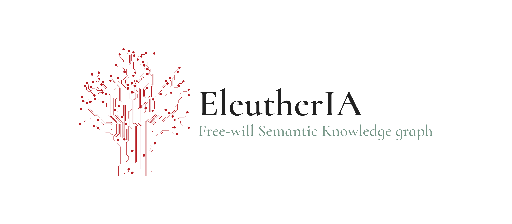

<p align="center">
  
</p>

# EleutherIA - Ancient Free Will Database

**A Comprehensive FAIR-Compliant Knowledge Graph of Greco-Roman and Early Christian Debates on Freedom, Fate, and Moral Responsibility**

---

## About the Name

**EleutherIA** is a bilingual wordplay combining:
- **Ἐλευθερία** (*eleutheria*) - Ancient Greek for "freedom" or "liberty"
- **IA** - Intelligence Artificielle (Artificial Intelligence)

The name reflects the project's dual nature: ancient philosophical debates on freedom powered by modern AI techniques (GraphRAG, embeddings, semantic search).

---

[](https://creativecommons.org/licenses/by/4.0/)
[](https://semver.org/)
[](https://www.go-fair.org/fair-principles/)

## Overview

This database represents the **first comprehensive digital mapping** of ancient free will debates in Greco-Roman and early Christian philosophy and theology. It covers 8 historical phases spanning from Aristotle (4th c. BCE) to Boethius (6th c. CE), documenting the evolution of key concepts, arguments, and philosophical-theological positions.

**Version:** 1.0.0
**Release Date:** October 17, 2025
**Format:** JSON
**Size:** ~13 MB
**License:** CC BY 4.0

## Key Features

- **465 nodes** documenting persons, works, concepts, arguments, and debates
- **745 edges** mapping relationships, influences, and critiques
- **8 historical phases** from 4th century BCE to 6th century CE
- **200+ bibliography references** (ancient sources + modern scholarship)
- **Greek/Latin terminology** preserved with transliterations
- **FAIR-compliant** (Findable, Accessible, Interoperable, Reusable)
- **GraphRAG-ready** with support for embeddings and semantic search
- **Publication-ready** with full citation metadata

## Modern AI Integration: GraphRAG

**EleutherIA** leverages cutting-edge **GraphRAG (Graph-based Retrieval-Augmented Generation)** techniques, making it ideal for modern AI applications:

### 🔬 What is GraphRAG?

GraphRAG combines traditional knowledge graphs with modern AI capabilities:
- **Structured Knowledge:** 465 nodes and 745 edges provide explicit relationships
- **Semantic Embeddings:** Rich textual descriptions ready for vector embeddings
- **Contextual Retrieval:** Navigate complex philosophical arguments through graph traversal
- **LLM Integration:** Feed structured context to large language models for accurate reasoning

### 🚀 AI-Ready Features

**Vector Embeddings Support:**
- Every node contains rich descriptions suitable for embedding generation
- Optimized for **Google Gemini** highest quality embeddings (text-embedding-004)
- Also compatible with OpenAI, Anthropic, Cohere, and open-source embedding models
- Multi-field embeddings: combine labels, descriptions, ancient sources, and modern scholarship

**Semantic Search:**
- Find conceptually related arguments across different philosophical schools
- Discover implicit connections between Stoic, Epicurean, and Patristic positions
- Query by meaning rather than exact keyword matching

**RAG Pipeline Integration:**
- Use graph structure to provide relevant context to LLMs
- Navigate from concepts → arguments → persons → works automatically
- Retrieve multi-hop relationships (e.g., "Who influenced those who refuted Stoic compatibilism?")

**Hybrid Search:**
- Combine graph traversal with semantic similarity
- Filter by historical period, school, or node type before semantic ranking
- Leverage explicit relationships (edges) alongside implicit semantic connections

### 💡 Example Use Cases

**1. Philosophical Question Answering:**
```python
# Query: "How did early Christians respond to Stoic determinism?"
# GraphRAG approach:
# 1. Find Stoic determinism concepts via semantic search
# 2. Traverse 'refutes' edges to find counter-arguments
# 3. Filter by period='Patristic' to get Christian responses
# 4. Generate embeddings for all relevant nodes
# 5. Feed to LLM with structured context
```

**2. Argument Mining:**
- Extract all arguments pro/con free will across 8 centuries
- Cluster similar arguments using embeddings
- Trace influence chains through graph edges

**3. Comparative Analysis:**
- Compare Aristotelian vs. Christian concepts of freedom using semantic similarity
- Find terminology evolution (Greek eph' hêmin → Latin liberum arbitrium)
- Map conceptual reformulations across philosophical traditions

**4. Interactive Research Assistant:**
- Ask questions in natural language
- Retrieve relevant nodes via semantic search
- Navigate graph structure for comprehensive context
- Generate historically-grounded answers with citations

### 🛠️ Implementation Examples

**Generate Embeddings (Google Gemini - Recommended):**
```python
import google.generativeai as genai
import json

# Configure Gemini
genai.configure(api_key='YOUR_API_KEY')

with open('ancient_free_will_database.json') as f:
    db = json.load(f)

for node in db['nodes']:
    # Combine fields for rich embeddings
    text = f"{node['label']}: {node['description']}"
    if 'ancient_sources' in node:
        text += " Sources: " + "; ".join(node['ancient_sources'])
    if 'modern_scholarship' in node:
        text += " Scholarship: " + "; ".join(node['modern_scholarship'])

    # Generate embedding with Gemini's highest quality model
    result = genai.embed_content(
        model="models/text-embedding-004",
        content=text,
        task_type="retrieval_document"
    )
    node['embedding'] = result['embedding']

print(f"Generated {len(db['nodes'])} embeddings with Gemini")
```

**Alternative: OpenAI Embeddings:**
```python
import openai
import json

with open('ancient_free_will_database.json') as f:
    db = json.load(f)

for node in db['nodes']:
    text = f"{node['label']}: {node['description']}"
    embedding = openai.Embedding.create(
        input=text,
        model="text-embedding-3-large"
    )
    node['embedding'] = embedding['data'][0]['embedding']
```

**Semantic Search + Graph Traversal:**
```python
from sentence_transformers import SentenceTransformer
import numpy as np

# Load model
model = SentenceTransformer('all-MiniLM-L6-v2')

# Query
query = "arguments against determinism"
query_embedding = model.encode(query)

# Find most similar nodes
similarities = []
for node in db['nodes']:
    if 'embedding' in node:
        sim = np.dot(query_embedding, node['embedding'])
        similarities.append((sim, node))

# Get top results
top_nodes = sorted(similarities, reverse=True)[:5]

# Traverse graph for related content
for score, node in top_nodes:
    # Find all edges connected to this node
    related = [e for e in db['edges']
               if e['source'] == node['id'] or e['target'] == node['id']]
```

**LangChain Integration (with Gemini + Chroma):**
```python
from langchain_google_genai import GoogleGenerativeAIEmbeddings
from langchain_community.vectorstores import Chroma
from langchain.schema import Document

# Initialize Gemini embeddings
embeddings = GoogleGenerativeAIEmbeddings(
    model="models/text-embedding-004",
    google_api_key="YOUR_GEMINI_API_KEY"
)

# Convert nodes to documents
documents = [
    Document(
        page_content=f"{n['label']}: {n['description']}",
        metadata={
            'id': n['id'],
            'type': n['type'],
            'period': n.get('period', ''),
            'school': n.get('school', ''),
            'label': n['label']
        }
    )
    for n in db['nodes']
]

# Create Chroma vector store (persistent, local)
vectorstore = Chroma.from_documents(
    documents=documents,
    embedding=embeddings,
    persist_directory="./chroma_db"  # Saved locally
)

# Semantic search with metadata filtering
results = vectorstore.similarity_search(
    "Stoic arguments for compatibilism",
    k=5,
    filter={"school": "Stoic"}
)

for doc in results:
    print(f"• {doc.metadata['label']} ({doc.metadata['type']})")
    print(f"  {doc.page_content[:100]}...")
```

**Alternative Vector Databases:**

**Qdrant (High Performance):**
```python
from langchain_community.vectorstores import Qdrant
from qdrant_client import QdrantClient

client = QdrantClient(path="./qdrant_db")  # Local storage
vectorstore = Qdrant.from_documents(
    documents,
    embeddings,
    client=client,
    collection_name="eleutheria"
)
```

**Pinecone (Cloud-Based):**
```python
from langchain_pinecone import PineconeVectorStore
import pinecone

pinecone.init(api_key="YOUR_API_KEY")
vectorstore = PineconeVectorStore.from_documents(
    documents,
    embeddings,
    index_name="eleutheria"
)
```

**FAISS (Fast, In-Memory):**
```python
from langchain_community.vectorstores import FAISS

# Good for quick prototyping, but not persistent
vectorstore = FAISS.from_documents(documents, embeddings)
```

### 📊 Why GraphRAG for Philosophy?

**Precision:** Graph edges encode explicit logical relationships (refutes, supports, influenced)
**Context:** Multi-hop traversal provides comprehensive philosophical context
**Provenance:** Every claim traceable to ancient sources
**Terminology:** Preserve Greek/Latin terms while enabling semantic search
**Chronology:** Temporal structure shows evolution of ideas across centuries

**Traditional RAG limitations:**
- ❌ Loses explicit relationships between arguments
- ❌ Cannot distinguish "influences" from "refutes"
- ❌ Struggles with technical terminology across languages

**GraphRAG advantages:**
- ✅ Preserves logical structure of philosophical debates
- ✅ Combines semantic similarity with explicit relationships
- ✅ Maintains historical and conceptual context
- ✅ Enables multi-lingual reasoning (Greek/Latin/English)

## Coverage

### Historical Phases

1. **Phase 1: Critical Foundations** - Cicero, Aristotle, Epicurus/Lucretius, Alexander of Aphrodisias
2. **Phase 2: Plato, Socrates, Presocratics** - Platonic psychology, Socratic intellectualism, Democritean necessity
3. **Phase 3: Stoicism** - Chrysippus, compatibilism, heimarmenê (fate)
4. **Phase 4: Academic Skepticism** - Carneades, CAFMA, incompatibilism
5. **Phase 5: Middle Platonism** - Alcinous, providence/fate distinction
6. **Phase 6: Patristics/Early Christian Theology** - Origen, Justin Martyr, autexousion (Christian free will)
7-8. **Phases 7-8: Synthesis** - Boethius, terminology evolution (Greek → Latin), debate structure

### Philosophical Positions

- **Aristotelian Framework:** Voluntary (hekousion), deliberation, eph' hêmin (in our power)
- **Stoic Compatibilism:** Universal fate compatible with moral responsibility via internal causation
- **Epicurean Indeterminism:** Atomic swerve (parenklisis/clinamen) breaks causal necessity
- **Academic Incompatibilism:** Carneades' CAFMA - fate destroys freedom, responsibility, justice
- **Alexandrian Libertarianism:** Self-initiated action as originating principle
- **Middle Platonist Synthesis:** Providence ≠ fate; soft determinism
- **Christian Autexousion:** Self-determining power necessary for divine justice and theodicy
- **Boethian Solution:** Divine eternity reconciles foreknowledge with freedom

### Key Figures (Selection)

- Aristotle, Plato, Socrates, Democritus
- Epicurus, Lucretius
- Chrysippus, Carneades
- Cicero, Alexander of Aphrodisias
- Alcinous (Albinus)
- Origen of Alexandria, Justin Martyr
- Boethius

## Database Structure

### Node Types

| Type | Count | Description |
|------|-------|-------------|
| **person** | 156 | Philosophers, theologians, authors |
| **work** | 48 | Treatises, dialogues, letters |
| **argument** | 113 | Specific philosophical arguments |
| **concept** | 80 | Philosophical concepts and terms |
| **debate** | 3 | Major philosophical controversies |
| **controversy** | 5 | Specific disputes |
| **reformulation** | 53 | Conceptual reformulations |
| **event** | 2 | Historical events |
| **school** | 1 | Philosophical schools |
| **group** | 3 | Philosophical groups |
| **argument_framework** | 1 | Systematic argument structures |

### Node Schema

Each node contains:

**Required fields:**
- `id`: Unique identifier (e.g., `person_aristotle_384_322bce_b2c3d4e5`)
- `label`: Human-readable name
- `type`: Node type (person, work, concept, argument, etc.)
- `category`: "free_will"
- `description`: Comprehensive description

**Common optional fields:**
- `dates`: Birth-death or composition dates
- `period`: Historical period (e.g., "Classical Greek", "Hellenistic", "Patristic")
- `school`: Philosophical school affiliation
- `ancient_sources`: Primary textual sources with citations
- `modern_scholarship`: Secondary literature references
- `key_concepts`: Associated philosophical concepts
- `position_on_free_will`: Position summary
- `historical_importance`: Influence and legacy

### Edge Schema

Each edge contains:

**Required fields:**
- `source`: Source node ID
- `target`: Target node ID
- `relation`: Relationship type

**Optional fields:**
- `description`: Detailed description of relationship
- `ancient_source`: Primary source citation
- `type`: Edge classification

### Relation Types

- **Authorship:** `formulated`, `authored`, `developed`
- **Influence:** `influenced`, `transmitted`, `transmitted_in_writing_by`
- **Logic:** `opposes`, `refutes`, `supports`, `defends`, `targets`
- **Structure:** `component_of`, `related_to`, `reformulated_as`
- **Usage:** `used`, `employed`, `adapted`, `appropriates`
- **Analysis:** `synthesizes`, `exemplifies`, `reinterprets`, `develops`

## FAIR Compliance

This database adheres to **FAIR principles** (Findable, Accessible, Interoperable, Reusable):

### Findable

- **F1:** Persistent identifier (DOI) to be assigned upon publication
- **F2:** Rich metadata describing content, coverage, and provenance
- **F3:** Unique IDs for all nodes
- **F4:** Will be registered in research data repositories (Zenodo, etc.)

### Accessible

- **A1:** Retrievable via open web protocols (JSON format)
- **A2:** Metadata accessible even if data becomes unavailable
- **A3:** Open license (CC BY 4.0) enables broad reuse

### Interoperable

- **I1:** Standard JSON format with clear schema
- **I2:** Controlled vocabulary (standardized Greek/Latin terms, relation types)
- **I3:** References to external resources (Perseus Digital Library, Stanford Encyclopedia, etc.)

### Reusable

- **R1:** Clear CC BY 4.0 license
- **R2:** Detailed provenance (sources, bibliography, methodology)
- **R3:** Domain-relevant standards (ancient philosophy, digital humanities)
- **R4:** Semantic versioning (1.0.0)

## Usage Examples

### Loading the Database

**Python:**
```python
import json

with open('ancient_free_will_database.json', 'r', encoding='utf-8') as f:
    db = json.load(f)

# Access metadata
print(db['metadata']['title'])
print(f"Total nodes: {db['metadata']['statistics']['total_nodes']}")

# Access nodes
for node in db['nodes']:
    if node['type'] == 'person':
        print(f"{node['label']} ({node.get('dates', 'unknown')})")

# Access edges
for edge in db['edges']:
    if edge['relation'] == 'refutes':
        print(f"{edge['source']} refutes {edge['target']}")
```

**JavaScript:**
```javascript
fetch('ancient_free_will_database.json')
  .then(response => response.json())
  .then(db => {
    console.log(db.metadata.title);
    console.log(`Total nodes: ${db.metadata.statistics.total_nodes}`);

    // Filter persons
    const persons = db.nodes.filter(n => n.type === 'person');
    persons.forEach(p => console.log(`${p.label} (${p.dates || 'unknown'})`));
  });
```

### Query Examples

**Find all Stoic philosophers:**
```python
stoics = [node for node in db['nodes']
          if node['type'] == 'person' and 'Stoic' in node.get('school', '')]
```

**Find all works by Aristotle:**
```python
aristotle_works = [edge['target'] for edge in db['edges']
                   if 'aristotle' in edge['source'] and edge['relation'] == 'authored']
```

**Find all arguments that refute Stoic positions:**
```python
anti_stoic_args = [edge for edge in db['edges']
                   if edge['relation'] == 'refutes' and 'stoic' in edge['target'].lower()]
```

**Find all Patristic/theological figures:**
```python
patristics = [node for node in db['nodes']
              if node['type'] == 'person' and 'Patristic' in node.get('school', '')]
```

## Citation

### How to Cite

When using this database in publications, please cite:

**APA:**
> Girardi, R. (2025). *EleutherIA - Ancient Free Will Database: A Comprehensive Knowledge Graph of Greco-Roman and Early Christian Debates on Freedom, Fate, and Moral Responsibility* (Version 1.0.0) [Data set]. https://doi.org/[to-be-assigned]

**BibTeX:**
```bibtex
@dataset{girardi2025eleutheria,
  author = {Girardi, Romain},
  title = {EleutherIA - Ancient Free Will Database: A Comprehensive Knowledge Graph of Greco-Roman and Early Christian Debates on Freedom, Fate, and Moral Responsibility},
  year = {2025},
  version = {1.0.0},
  publisher = {[To be assigned]},
  doi = {[To be assigned]},
  url = {[To be assigned]}
}
```

## License

This work is licensed under a [Creative Commons Attribution 4.0 International License](https://creativecommons.org/licenses/by/4.0/).

**You are free to:**
- **Share** — copy and redistribute the material in any medium or format
- **Adapt** — remix, transform, and build upon the material for any purpose, even commercially

**Under the following terms:**
- **Attribution** — You must give appropriate credit, provide a link to the license, and indicate if changes were made

## Data Provenance

### Sources

- **Primary sources:** Ancient Greek and Latin texts (Aristotle, Cicero, Epicurus, Lucretius, Alexander of Aphrodisias, Plato, Chrysippus, Carneades, Alcinous, Origen, Justin Martyr, Boethius)
- **Secondary sources:** 200+ modern scholarly references including:
  - Bobzien, S. (1998). *Determinism and Freedom in Stoic Philosophy*
  - Frede, M. (2011). *A Free Will: Origins of the Notion in Ancient Thought*
  - Sorabji, R. (1980). *Necessity, Cause and Blame*
  - Long, A.A. & Sedley, D.N. (1987). *The Hellenistic Philosophers*
  - And many others (see individual node entries)

### Methodology

- Systematic extraction from doctoral research
- Organized in 8 historical phases
- All nodes include ancient source citations and modern scholarship
- Greek/Latin terminology preserved with transliterations
- Quality control: no hallucinated content, all claims grounded in sources

## Related Resources

- **Perseus Digital Library:** http://www.perseus.tufts.edu/
- **Stanford Encyclopedia of Philosophy:** https://plato.stanford.edu/
- **PhilPapers:** https://philpapers.org/browse/free-will
- **TLG (Thesaurus Linguae Graecae):** Textual sources for Greek
- **PHI Latin Texts:** Textual sources for Latin

## Contact

- **Questions:** romain.girardi@univ-cotedazur.fr
- **Corrections:** Please submit issues via GitHub repository or email romain.girardi@univ-cotedazur.fr
- **Collaborations:** romain.girardi@univ-cotedazur.fr

## Acknowledgments

This database was created as part of doctoral research on ancient free will debates at **Université Côte d'Azur (CEPAM)** and **Université de Genève (Faculté de Théologie Jean Calvin)**.

Special thanks to my doctoral advisors: **Arnaud Zucker** (CEPAM, Université Côte d'Azur) and **Andreas Dettwiler** (Faculté de Théologie Jean Calvin, Université de Genève), and to the research communities at both institutions.

## Version History

### Version 1.0.0 (2025-10-17)
- Initial release
- 465 nodes across 8 historical phases
- 745 edges mapping relationships and influences
- Comprehensive coverage from Aristotle to Boethius
- FAIR-compliant metadata structure

## Updates and Contributions

Corrections and additions are welcome! Major updates will increment the version number according to semantic versioning.

For contributing, please contact romain.girardi@univ-cotedazur.fr or submit issues via the GitHub repository.

---

**Database created by:** Romain Girardi
**Email:** romain.girardi@univ-cotedazur.fr
**ORCID:** [0000-0002-5310-5346](https://orcid.org/0000-0002-5310-5346)
**Affiliation:** Université Côte d'Azur, CEPAM; Université de Genève, Faculté de Théologie Jean Calvin
**Date:** October 17, 2025
**Version:** 1.0.0
**License:** CC BY 4.0
